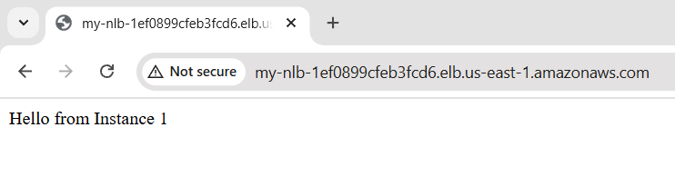

Terraform Init
Terraform plan
Terraform apply

Apply complete! Resources: 4 added, 0 changed, 0 destroyed.

Outputs:

nlb_dns_name = "abcd.us-east-1.amazonaws.com"
web_server_1_id = "i-1"
web_server_2_id = "i-2"

